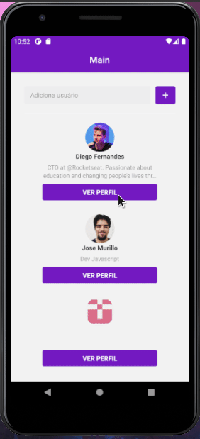

# Application of learning to ReactNative 💜🎉

### What learning was possible with this project? 🤔
    💜 The basic of React Native
    ------------------------
      🔥 Hooks
      🔥 Props
      🔥 States
    ------------------------
    ☄ Using api of Github
    ✨ Stack Navigation
    📩 Axios for request http's
    🔧 Config Reactotron

### Screen of App 💖

